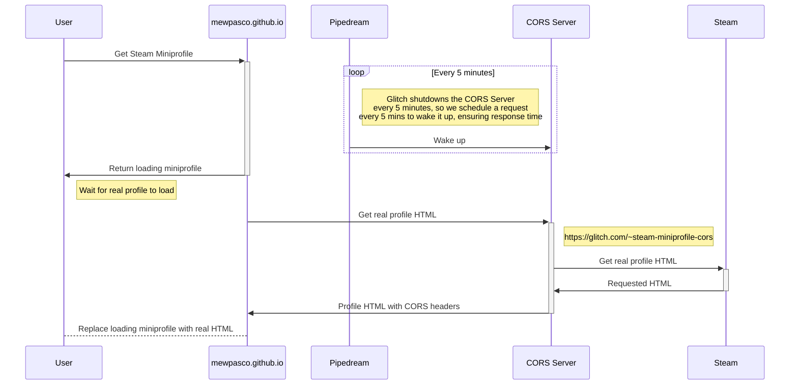

> [!CAUTION]
> # ⚠️ **Disclaimer**  
> This is **not my original project**.  
> It is a **fork** of [steam-miniprofile](https://github.com/mewpasco/steam-miniprofile-fork) with personal customizations.  
> All credit goes to the original creator(s).

# Contact me through Discord

[](https://discord.gg/avia)

# A little tool to feature Steam's miniprofile on your website 

This is a tool that loads your miniprofile(*with animated background and frame*) as a HTML entity so that you can feature it on your website.

This tool only shows **PUBLIC** information of your Steam account and therefore **DOES NOT NEED your Steam's API KEY or CREDENTIALS**. 

### Preview:  


## See it in action on my website: https://avariaxyz.win/

## Guide

1. Get your Steam's **ID**, you can use any of these IDs from [SteamDB](https://steamdb.info/calculator/) or google how to find it yourself.


2. Replace *YOUR_ACCOUNTID_HERE* with the ID acquired from step 1
```html
 https://mewpasco.github.io/steam-miniprofile-fork/?accountId=YOUR_ACCOUNTID_HERE
```
Examples: 
- https://mewpasco.github.io/steam-miniprofile-fork/?accountId=846635687
- https://mewpasco.github.io/steam-miniprofile-fork/?accountId=76561198806901415
- https://mewpasco.github.io/steam-miniprofile-fork/?accountId=STEAM_1:1:423317843
- https://mewpasco.github.io/steam-miniprofile-fork/?accountId=[U:1:846635687]

### Internationalization / Change Language
Add query parameter `lang` in your URL.

Example: 

https://mewpasco.github.io/steam-miniprofile-fork/?lang=schinese

Available languages: `bulgarian,danish,english,french,greek,italian,koreana,polish,brazilian,russian,latam,swedish,tchinese,ukrainian,czech,dutch,finnish,german,hungarian,japanese,norwegian,portuguese,romanian,schinese,spanish,thai,turkish,vietnamese`

### Featured Game
This will let you display your favorite game with your playtime on it.
Add query parameter `appId` in your URL.

Example: 


https://mewpasco.github.io/steam-miniprofile-fork/?accountId=80655735&appId=1361210

#### Notes:
- You **MUST** have your `Game details` privacy settings set to `Public`
- You can look up a game's appId using [SteamDB](https://steamdb.info/)

### Interactive
You can make the content clickable and open your steam profile on click using `interactive` and `vanityId` search params.
1. `vanityId` is what comes after your normal steamcommunity links 
Example: `https://steamcommunity.com/id/mewpasco` -> vanityId = `mewpasco`
2. `interactive=true` \
3. `&appId=1085660` at the end to go full on with your favorite game on top!

Full example: https://mewpasco.github.io/steam-miniprofile-fork/?interactive=true&vanityId=mewpasco&appId=1085660

### To add this to your site
1.   You can load it into any div with JQuery or Javascript. [Jquery's Load() guide](https://www.tutorialspoint.com/How-to-load-external-HTML-into-a-div-using-jQuery).
2.  You can also load it as an _iframe_  
    >   `<iframe src="https://mewpasco.github.io/steam-miniprofile-fork/?accountId=YOUR_ACCOUNTID_HERE" style="border:0px #ffffff none;" name="myiFrame" scrolling="no" frameborder="1" marginheight="0px" marginwidth="0px" height="400px" width="600px" allowfullscreen></iframe>`
-   Once it's loaded, you can mod it however you like using CSS.
-   A working example can be found at [My site](https://avariaxyz.win/).

### How it works



#### Note
- This works by calling Steam's API and render the response with Steam's CSS. *This site is not affiliated with Steam or Valve*.
- Your profile will need to be public for this to work.
- ~~It will track your _public_ status (Online, Offline), but it *wont* track your _friend-only_ status (Away, Snooze,...)~~.
- You need to have your `Game Details` privacy settings set to `PUBLIC` if you want to show rich presence with `steam-miniprofile`.
- If your AccountID is invalid, it will instead load *MY* (as in the one writing this) miniprofile :).
- You might have to disable caching of the _iframe_ on your web, or changes on Steam won't be reflected immediately.


> [!IMPORTANT]
> **Show some love to the Original Creator** \
> If you decide to use this tool, I'd love to see you show it off in [Discussion](https://github.com/gamer2810/steam-miniprofile/discussions/categories/show-and-tell).

### Issues
If the tool does not work, please open an [Issue](https://github.com/mewpasco/steam-miniprofile-fork/issues/new) and I will take a look.
